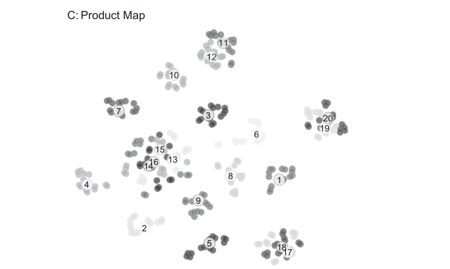
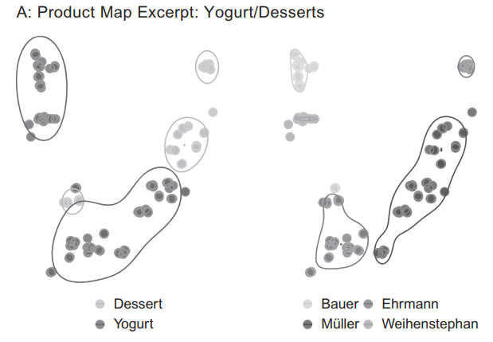
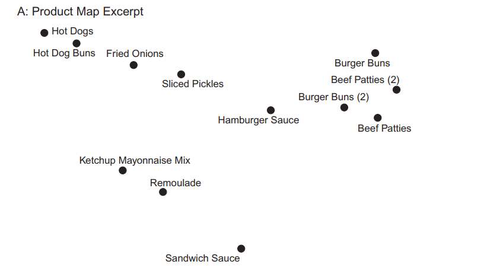
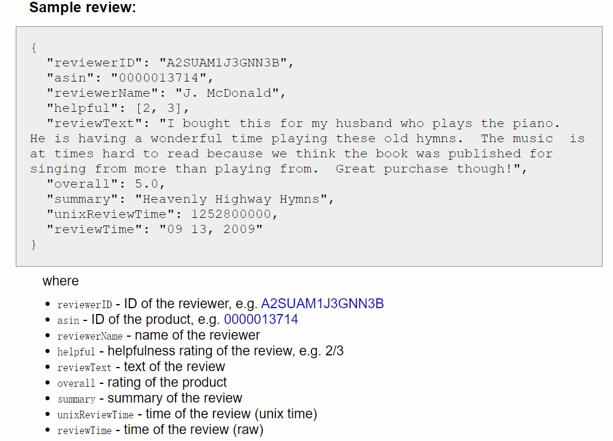
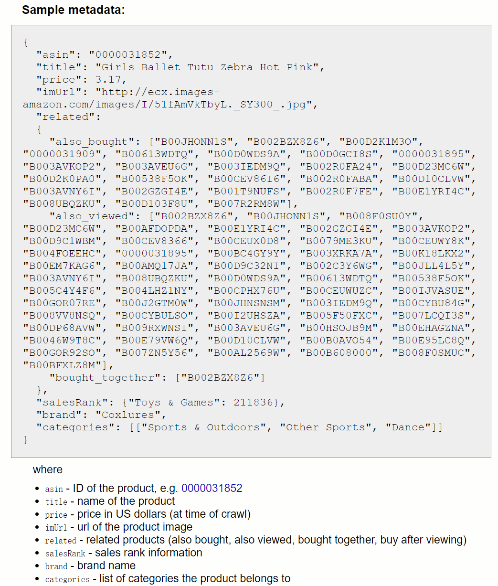
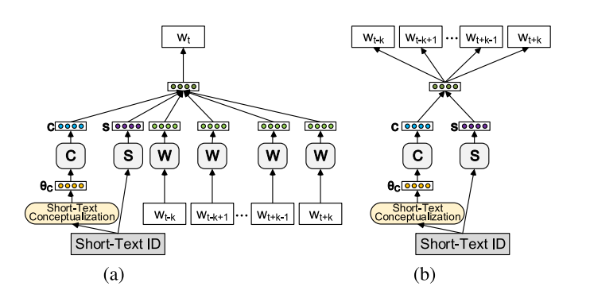
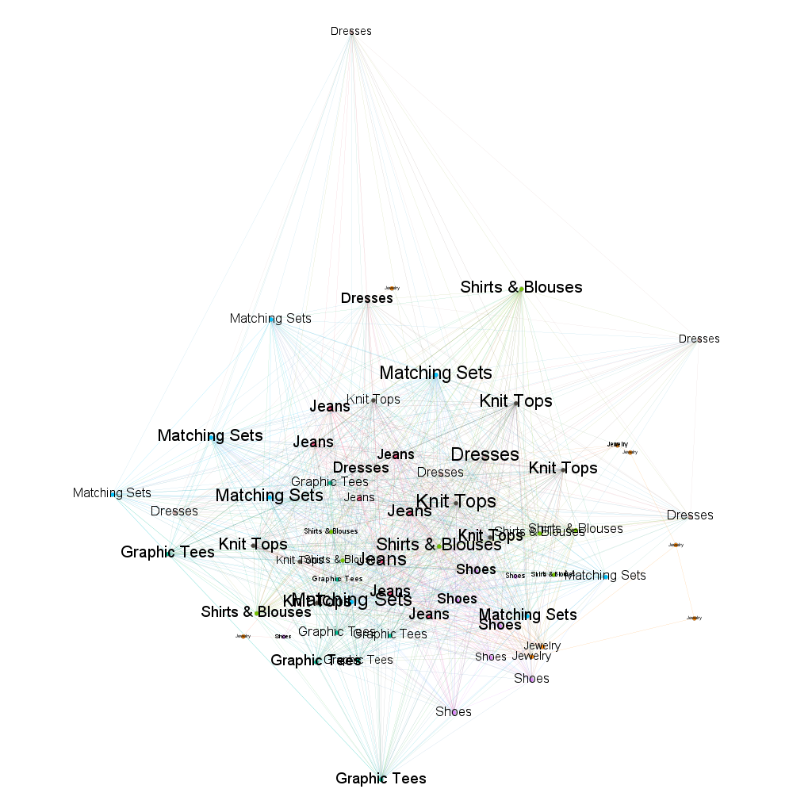
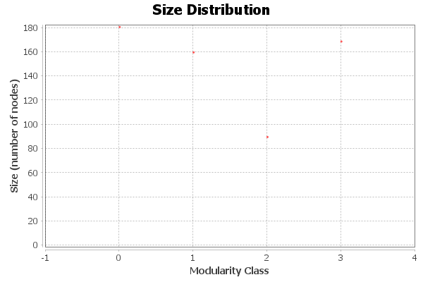
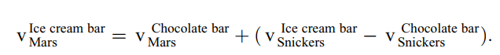
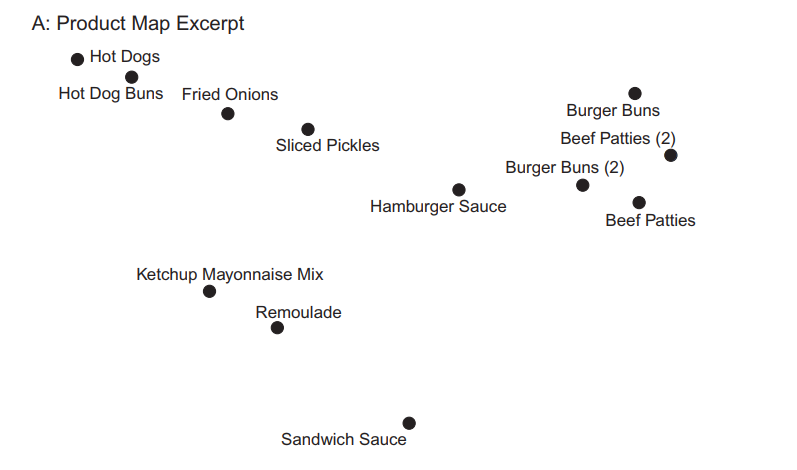

# 1. 我们需要什么样的数据去做市场结构分析

## 1.0 市场结构分析有什么用

分析得到一系列的结构后，可以干嘛。

- 竞品分析：分析哪些类之间存在竞争关系，以及竞争关系初步量化（散点图覆盖大小以及气泡大小）
- 客户忠诚度分析：判断整体客户的忠诚度，主要是对品牌忠诚度的研究。（我们的研究中可能缺乏对具体品牌忠诚度的反应），但是可以对独立站站体本身的忠诚度进行研究。
- 产品级别的相关性分析：从类别到产品，研究具体的产品之间的相关性。

主要是三个维度的分析

具体到独立站本身上，有什么作用。

- 方向指导意义，大类别---》选品
- 产品竞争市场结构的分析为新产品设计和开发，产品竞争性广告，产品定价，产品定位和传播策略提供必不可少的启示和指导作用 [Visualizing Asymmetric Competition Among Mor](https://www.jstor.org/stable/44012167) 基于不同的数据进行不同程度的分析。
- 可以通过分析市场结构，推测在特定市场中的流行产品及竞争对手的形式来选择他们的产品。

### 1.0.1 类别的市场结构分析

==竞品分析==：在产品映射下，不同类别距离越近越具有竞争关系。密集程度体现了竞争影响力大小。

==客户忠诚度评价==：客户对某一特定产品或服务产生好感，进而重复购买的一种趋向。具体是体现在不同维度上的分析。

### 1.0.2 产品级别的市场结构

==产品级别的互补分析==

## 1.1 我们目前有什么数据

['shop_idx', 'url', 'title', 'body_html', 'img', 'publish_date', 'updated_date', 'vendor', 'product_type', 'tags']

分类：

- 商品信息描述：title，product_type，tags
- 时间信息：最后一次购买时间：updated_date     发行时间：publish_date
- 其他信息：vendor，数据展示：img

## 1.2 我们需要什么样的数据

首先，我们的目标是对带有**时间信息**的独立站销售商品的数据进行数据结构分析，想通过图网络的形式进行呈现。希望呈现的效果不要过于单一，即一个商品可以属于**多种类别**，商品与商品之间存在一定的联系，即网络关系。当类别与类别之间的连接较多时，即认为它们具有强**关联性**。

- 时间信息，商品售卖出去的时间，有人买说明对这类的商品存在需求。如果该类的商品需求很大，即在某一段时间内，较多的该类型的产品卖出去了。
- 商品类型，这个是进行图网络的关键信息，没有商品类型信息，则无法判断商品与商品之间的相似性。

注意：其中时间信息并不代表时间序列。如果说先做好了图网络问题，即先将商品进行了相似性的度量，可以将时间信息转化为时间序列进行聚类。

## 1.3 遇到的问题

==问题==： 

- 从数据本身来看，似乎没有理由分析类间关系，因此并不存在类与类之间的信息。首先，并不存在多个类别关联的信息，比如买家数据，日志数据等。
- 其次，我们的数据主要是单个的信息。主要的信息就是对单个商品的描述信息。

关于目前按照顺序采样2000个样本进行实验的其他问题：

1. 数据量不够大或者说titile文字体现不明显，titile里很多文字只出现一次，可能一个title中所有文字只在语料库中出现一次。
2. 经过处理后的title_len  avg = 4.808，语料库的大小为2899，平均每个单词出现次数为3.317。

- 文本较短，提取特征不明显，尽管是进行tf-idf提取还是进行word2vec对单词进行嵌入表达。这都影响后续的图网络效果呈现以及其他方式的嵌入学习。

# 2. 方法

目前想通过图网络先将所有的商品进行一个网络化的连接。

我们进行text classification 的时候，并不需要很强烈的语言的顺序。

有如下几种方式：

[Review of Graph Neural Network in Text Classification](https://ieeexplore.ieee.org/stamp/stamp.jsp?tp=&arnumber=9666633)

## 2.1 Text GCN

解决的问题：

之前的文本分类只能单独对文本自身的上下文进行语义提取，而不能够对文本之间的相关信息进行表示。[引注](https://blog.csdn.net/qq_36426650/article/details/107838229)

思路：

采用共现词方式，节点数由文本书和不重复单词数决定。节点的边由文章中单词共现和语料库中单词共现构建。边的权重采用的是tf-idf值。信息传递最多两阶。两层GCN架构。

$$ A_{ij}=\left\{
\begin{aligned}
PMI(i,j) & \ i,j \ are \ words, PMI(i,j)>0\   \\
TF-IDF_{ij} & \ i\ is\ document, j  \ is \ word \\
1 & \ i = j \\0 & \ otherwise \\
\end{aligned}
\right.$$

问题：

没有考虑到单词的顺序。可以考虑注意力机制来应对长尾数据。

## 2.2 Text Level GNN for Text Classification

构造TextGCN时，边的权重时固定的（单词节点间的边权重是两个单词的PMI，文档-单词节点间的边权重是TF-IDF），限制了边的表达能力，且无法为新样本进行在线测试。

- 为每个输入文本单独构建一个图，文本中的单词作为节点

## 2.3 MAGNET： Multi-Label Text Classification Using Attention-based GNN

解决的问题：为语料库中的文档分配不同的标签

为了更好的捕捉标签之间的联系，基于注意力的图神经网络（MAGNET），基于特征矩阵自动学习标签之间的关系。

## 2.4 Short Text

短的文本经常出现在推特、聊天信息、商品描述、在线评论等。

**痛点问题**：所研究的短文本缺乏在较长句子和段落中普遍存在的结构，因而认为传统的文本分类技术无法推广到短文本中。因此认为单纯的文本信息不足够进行text classification，因而引入了更多的信息，如用户查询日志，元数据等信息。

存在难点：

- 短文本高度稀疏，缺乏足够的特征来提供足够的词共现。
- 与其他的文本资源不同，**大多数短文本语料库没有语言结构或遵循语法结构。**

解决方法：

- side-information： 从用户的行为信息获得，insight来自用户之间的行为相似性。

### 2.4.1 数据描述

首先，数据都来自**amazon.com**

1. 当做==Product Query Classification== 时，有来自从亚马逊搜索引擎的匿名**用户查询**的日志信息，对于两个查询$i$ 和 $j$, 邻接矩阵$A$ 的构造是 $A_{ij} = \# common\  purchase\  b/w \ query \ i \ and \ query \ j $

2. 当作==Product Title Classification==时，数据包括product titles， metadata for each product （also bought， also viewed， bought together， buy after viewing） and their categories。对于每个产品，它的类别是从颗粒度标签到细粒度标签的路径。(e.g.: Electronics ⇒ Computers & Accessories ⇒ Cables & Accessories)。 图的构造使用的是共同浏览（co-viewed），背后的原因是相较于共同购买，共同查看不一定会买，共同购买则更倾向于查看很多个商品，会忽略掉很多的信息。

表达节点信息：

1. bag-of-words
2. neural network

且这篇文章中所用到的数据集都是带有label且edge是完整的，而我们所研究的实际场景中需要自己去构建edge以及no label。

# 3. 我们需要做的内容

**最终目标**：对短文本进行聚类。

**中间过程**：

1. 可以对短文本概念化，生成文本的概念分布
2. 可以学习短文本嵌入表示

- 首先因为我们是短文本的数据，那么我们需要去观测我们短文本的特征，平均值，最大值，最小值，方差等。作为我们介绍数据的一个依据。以及我们包含的单词个数。
  - samples | vocabulary size | average length of sample（words）
- 其次，我们需要说明我们的文本语料库缺乏语言结构，[Short Text Classification in Twitter to Improve Information Filtering](https://dl.acm.org/doi/abs/10.1145/1835449.1835643) 。
- 同一类别的产品在标题文本上具有很丰富的多样性！因此，产品类型在文本特征空间中可能没有紧凑的表示。

==word2vec== 可以实现我们no label的学习。 

## 3.1 词的表示

### 3.1.1 one-hot encoding

维度较高，且词与词之间相互独立。

### 3.1.2 词的分布式表示

==CBOW==：

insight： 认为词的语义是由器上下文决定。 e.g  "the cat sits one the mat"， 在训练时，将"the cat sits one the"作为输入，预测最后一个词"mat", 可以采用LSTM方法。

### 3.1.3 词嵌入

核心：上下文的表示以及上下文与目标词之间的关系建模。

相较于3.1.1：

- 将vector 从整形转化为浮点型，变为整个实数范围的表示。

- 可以将稀疏的巨大维度压缩嵌入到一个更小的维度空间。

## 3.2 如何做

1. word2vec

- CBOW
- Skip-gram

上下文预测当前值以及当前值预测上下文相结合的形式

2. leverage conceptualization for short-text embedding

- 根据短文本的概念分布$\theta_C$ 生成该短文本的概念向量
- 

3. weighted word embedding aggregation

- 为文本中的每一个单词分配权重，根据单词的idf值分配。 [Representation learning for very short texts using weighted word embedding](https://reader.elsevier.com/reader/sd/pii/S0167865516301362?token=4C77FA694434CF27DA022640E27848876FF3706886158946A1CF59538DBCFA32E6F3E0363DC22D0B640696B997A80165&originRegion=us-east-1&originCreation=20221013071148)
- isf嵌入法，和tf-idf加权平均法类似。https://aclanthology.org/Q16-1028.pdf

4. graph2vec

- 将单词与单词之间的连接关系用tf-idf或者其他的形式表示，构造成一张图网络，然后运用图神经网络算法生成node embedding。

## 3.3 对比方法

baseline 与传统的nlp技术对比：

- bag of words
- n-grams
- tf-idf
- LDA

## 3.4  无监督方法

**K-means聚类**，可以多采取一些变种，先看看数据特征分布情况，再选择合适的无监督方式。

k-means依赖于初始值，因此可以进行多次实验，平均归一化互信息分数。

**计算互信息**：

互信息表达的是一个随机变量中包含的关于另一个随机变量的信息量。可以用于度量聚类结果的**相似程度**。

设两个随机变量$(X,Y)$的联合分布为$p(x,y)$， 边缘分布为$p(x),\ p(y)$, 互信息$I(X;Y) = \sum_x \sum_y p(x,y)log{p(x,y) \over p(x)p(y)}$ 

## 3.5 评价标准

#  4. fashionnova baseline

爬取过程中遇到的问题，访问过于频繁，且未采用分布式爬虫（没有可靠的ip池）

重新爬取了数据，虽然没有完全爬下来，但是比上次的数据集更丰富，且更集中。

不重复数据量：92816

fashionnova 数据爬虫流程图：

数据分布情况：

|      |     product_type     | proportion |
| :--: | :------------------: | :--------: |
|  0   |       Dresses        |   0.151    |
|  1   |      Knit Tops       |   0.064    |
|  2   |    Matching Sets     |   0.054    |
|  3   |        Shoes         |   0.051    |
|  4   |        Jeans         |   0.047    |
|  5   |       Jewelry        |   0.047    |
|  6   |   Shirts & Blouses   |   0.042    |
|  7   |     Graphic Tees     |   0.039    |
|  8   |      Jumpsuits       |   0.036    |
|  9   | Lingerie & Sleepwear |   0.033    |
|  10  |      Bodysuits       |   0.032    |
|  11  |       Swimwear       |   0.031    |
|  12  |        others        |   0.373    |

粗糙处理 body_html  -- > body_text： 

总共的单词数量是84204

词频统计：有247个单词词频超过1w

[('in', 106834), ('available', 91669), (',', 77077), ('and', 64223), ('to', 42431), ('polyester', 39656), ('black', 34949), ('5', 25320), ('the', 23124), ('spandeximported', 20605)]

有68685个单词词频小于5.

|      |     interval     | word_num |
| :--: | :--------------: | :------: |
|  0   |     [0, 100)     |  82887   |
|  1   |    [100, 200)    |   559    |
|  2   |    [200, 300)    |   172    |
|  3   |    [300, 400)    |   102    |
|  4   |    [400, 500)    |    65    |
| ...  |       ...        |   ...    |
| 1064 | [106400, 106500) |    0     |
| 1065 | [106500, 106600) |    0     |
| 1066 | [106600, 106700) |    0     |
| 1067 | [106700, 106800) |    0     |
| 1068 | [106800, 106900) |    1     |

大部分词频都是集中在[0,100]  

body_text 单词长度统计：

min_len : 0 

max_len : 570 

average_len : 18.940505947250475

## 实验

采取三种类型样本 Dresses  Shoes  Jeans，进行分析

样本数量：23110

[('Dresses', 14024), ('Shoes', 4710), ('Jeans', 4376)]

从里面分层抽样，三个类别都抽样200个样本

样本数量更小一点

8个类别 各随机取8个样本，总共64个样本  构造边  tf-idf > 0.01  共 984条边， modularity 0.328，共 7 个 community  这个可以调。

- Jewelry 权重较小，且与其他类的关联小，因此可以视为较独立的类别
- 

------

##  Parameters: 

Randomize:  On
Use edge weights:  On
Resolution:  1.0

##  Results: 

Modularity: 0.357
Modularity with resolution: 0.357
Number of Communities: 4

将节点模拟成原子，通过模拟原子之间的力场来计算节点之间的关系

Force Altas

- 惯性：值越大，图形的摇摆幅度越大
- 斥力强度：没有给节点排斥其他节点的强度，值越大，节点之间的距离越大
- 吸引强度：连接节点之间的吸引力的强度，值越大，有连接的节点越被拉近
- 重力：值越小，图越分散
- 速度：布局的速度，值越大，图布局的速度越快

This page is temporarily unavailable because a device from your location is sending large amounts of

即访问太过频繁。

解决方法： 代理池，降低访问频率

# 5.看的文献主要内容

P2V: 作者提出了新的探索性方法来分析市场结构，分析类别内替换关系以及跨类别的产品互补性。

- 先聚类，聚类观察**类别**之间的相似性。首先，类别就需要清晰的对类进行抽象，而不是对产品抽象。此时，类别数量可以多一点，因为此时我们需要做的是观察类别之间的关系，将一个类别抽象为一个点。最好是生成一个矩阵热力图的格式，方便对类与类之间进行分析。
- **产品级**抽象，即对每个产品进行聚类显示下来，目的是观察再某一个特定类别中产品之间的相似性以及差异性。这个样本可以少一点，取三个类别进行研究分析。

新的产品的向量是基于已经学习到的产品之间的线性结合

这就是对向量进行加减表示。认为商品是由几个属性组成的，每个属性代表一个向量。

另外一个方式是：找一些确实很靠近的样本，进行显示。抽样的时候进行特别处理，只抽样那些能够很好的区分开或者能够聚合比较清晰的样本。

